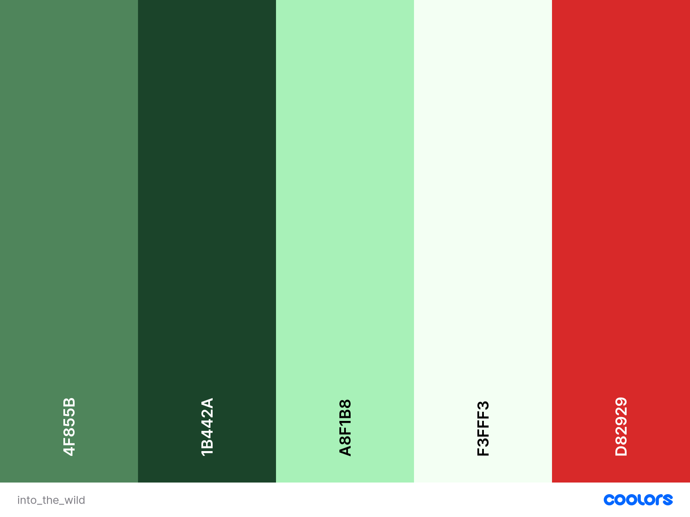

# **LetsQuiz**

## **Goal for this project** 
Into The Wild is a fun an challenging quiz game with focus on Animals.  The questions will be of varied difficulty. See if you can hit the top of the list! 

Thank you for visiting my project!
If you have any feedback or questions, head over to my GitHub contact details and feel free to reach out to me.

---

## Table of contents 

## **UX**

### **User Stories**

#### **User**
* As a user I want to be entertained by the game I am playing.
* As a user I want to be able to see how well I did compared to others.
* As a user I want to be able to learn new things, by playing the game.
* As a user I want to see the rigth answer to the question, when i have answered.
* As a user I want to be able to contact the owner, if i have anything to ask about.

#### **Owner** 
* As a owner I want people to strenghten their general knowledge.
* As a owner I want people to easily follow how to play the game.
* As a owner I want the game to be entertaining.
* As a owner I want people to play more than one round of the game. 

### **User Expectations**
* Easy to navigate.
* Flow of the sign up process takes a short time.
* Understand the purpose of the webiste within a short time.
* Be able to complain if any issues occure.

[Back to Top](#table-of-contents)

### **Design Choices**

#### **Fonts**
 I have visited [Google Fonts](https://fonts.google.com/ "Google Fonts") to explore the various options. The fonts used in this project are [Raleway] (https://fonts.google.com/specimen/Raleway) for the overall text and [Fira Sans] (https://fonts.google.com/specimen/Fira+Sans#standard-styles) for the headlines. The fonts have a light readthrough and do not come of as strong to the eye. It goes well in line with the hip and light design of the website. 

#### **Icons**
I have used icons from the [Font Awesome library](https://fontawesome.com/ "Font Awesome"). It is a limited amount of icons. But they fit the corresponding text. 

#### **Colors**

You can view my color scheme [here](assets/images/colors.png)

The feel of the game should be to step into a jungle and then get to know the different animals in there. 

* #4f855B: are used for all buttons on the screen. It is a Green color that goes well with the feel of a jungle. 

* #1B442A: Is a Dark Green color that is used to box in the question and title. It makes the text easily readable and fits well with the feel of the site. 

* #f3fff3: Is a smooth white color that is used for the text and for the outline of the categories. It fits well with the green color, and is easy to read. 

* #A8F1B8: Used when a answer is correct in the quiz. It is a much more green color than the other green colors. 

* #D82929: Is used for when a answer is wrong in the quiz. 

I have used to contract checker on Coolors in order to make sure that the contract is sufficient.
This way my content will be easily readable. 

#### **Changes made to color scheme**

### **Structure**
The website structure is built with [Bootstrap](https://getbootstrap.com/).
Bootstrap provides content for both CSS and JavaScript, as functionality with both is important.
As Bootstrap is designed for mobile first, I will be certain that my website functions well on mobile. 

#### **Home Page**
The home page is kept very simple, with only options to play the game, view highscores or to view the tutorial. 
In the bottom there will also be options to contact owner or go back to the start. THe CTA is for the user to easily understand the game, and then fast get started.

#### **Countdown Page** 
The countdown page has the same style as the others. The only function is to countdown to the game begins. 

#### **Quiz Page**
Again the look will be simple, and the focus will be on the game. The user will see the question and have 4 different answers to choose from. They will be able to see their score in the bottom. There will again be opportunity to contact owner or go back to the home page.  

#### **High Score** 
The High Score page will keep the users scores, and show who is the best. 
#### **Tutorial**

The tutorial will have the same design as the other pages. Here there will be 3 steps, that will quickly and easily tell the user what they need to do, to play the game. 

[Back to Top](#table-of-contents)

--- 

### **Wireframes**
I have decided to use [Balsamic](https://balsamiq.com/wireframes/) to create wireframes for my website. 
First I created a wireframe for mobile, as the approach is mobile first. Thereafter wireframes for desktop and tablets. 

You can find my wireframes below:

#### [Desktop Wireframes]
    [Home page](wireframes/desktop/home-page.png)
    [Quiz page](wireframes/desktop/play-page.png)
    [Tutorial page](wireframes/desktop/tutorial-page.png)
    [Countdown page](wireframes/desktop/countdown-page.png)
    [Contact page](wireframes/desktop/contact-page.png)

#### [Tablet Wireframes]
    [Home page](wireframes/tablet/tablet-home-page.png)
    [Quiz page](wireframes/tablet/tablet-play-page.png)
    [Tutorial page](wireframes/tablet/tablet-tutorial-page.png)
    [Countdown page](wireframes/tablet/tablet-countdown-page.png)
    [Contact page](wireframes/tablet/tablet-contact-page.png)

#### [Mobile Wireframes]
    [Home page](wireframes/mobile/mobile-home-page.png)
    [Quiz page](wireframes/mobile/mobile-play-page.png)
    [Tutorial page](wireframes/mobile/mobile-tutorial-page.png)
    [Countdown page](wireframes/mobile/mobile-countdown-page.png)
    [Contact page](wireframes/mobile/mobile-contact-page.png)

[Back to Top](#table-of-contents)

### **Features to be implemented**

* A brief description of each correct answer. 
* A motion into the jungle effect. 
* 3 lifes and then you are out function. 

[Back to Top](#table-of-contents)

## **Technologies used**

### **Languages**

* [HTML](https://en.wikipedia.org/wiki/HTML)
* [CSS](https://en.wikipedia.org/wiki/Cascading_Style_Sheets)
* [JavaScript](https://en.wikipedia.org/wiki/JavaScript)

### **Libraries & Frameworks**

* [Font Awesome](https://fontawesome.com/)
* [Bootstrap](https://getbootstrap.com/)
* [Google Fonts](https://fonts.google.com/)
* [Jquery](https://jquery.com/)

### **Tools**
* [Git](https://git-scm.com/)
* [GitPod](https://www.gitpod.io/)
* [Balsamic](https://balsamiq.com/wireframes/)
* [W3C HTML Validation Service](https://validator.w3.org/)
* [W3C CSS Validation Service](https://jigsaw.w3.org/css-validator/)

[Back to Top](#table-of-contents)

## **Bugs**
* Answer 4 was not displaying due to a bug in the loop interating through the questions. Fixed it by starting the loop at 1 instead of 0. 
* Score is not incrementing as expected. Had to change the design of the system. 
* 1 Could not change anything within the modal for the tutorial. 
 **Solution** 
* used !important to make my custom style a priority. tried other solutions, but this was the only one that worked. 

[Back to Top](#table-of-contents)

## **Testing**

### A first time visitor to this website

#### User story: 
* **Plan** 

* **Implementation**

* **Test**    

* **Result**  

* **Verdict**  

#### User story: 
* **Plan** 

* **Implementation**  

* **Test** 

* **Result** 

* **Verdict** 

#### User story: 
* **Plan** 

* **Implementation**

* **Test**  
 

* **Result** 

* **Verdict**  

#### User story:
* **Plan** 

* **Implementation** 

* **Test**   

* **Result**

* **Verdict**    

#### User story: 
* **Plan** 

* **Implementation**  

* **Test** 

* **Result** 

* **Verdict**     

[Back to Top](#table-of-contents)

## **Bugs**

### 2

### 3

[Back to Top](#table-of-contents)

## **Deployment**

I deployed my Ways project website in the following way:

* Logged in to my GitHub account and locating my repository
* Clicked on the settings icon (near the top right of the page)
* Scrolled down the page to locate the 'GitHub Pages' section
* Under "Source", select "Master" in the dropdown menu.
* In the tab next to "Source", select "/root" if not already selected by default
* Click save then the page will automatically refresh.
* The link should show in a banner just above "GitHub Pages" section.
* This deployed my project to the URL: ()

[Back to Top](#table-of-contents)

## **Credits**

### **Content - Media - Inspiration**

### **Acknowledgements**

[Back to Top](#table-of-contents)

